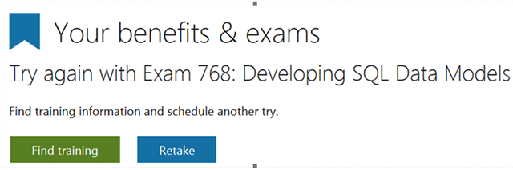

# More Tips About Beta Exams: What to Expect When You&#39;re Expecting (Your Beta Results, That Is)

Posted 15 Sep 2016 by **Liberty Munson (Microsoft)**

___

Recently, I have been seeing a lot of questions about several matters related to beta exams.

Let's start with the most pressing question... "The exam is now live . . . when will I get my score?!" It takes about 7-10 days. Here's why:

You may not realize this, but publishing exams is actually quite complicated, especially because we offer an online proctoring solution, have a large range of item types (some of which have very complicated scoring algorithms), and do some interesting things related to delivery to ensure the ongoing validity and reliability of the exams. As a result, we work with two different entities to publish exams. The first actually "builds" the exam to our specifications, and the second, of course, is VUE, who actually publishes the exam. To oversimplify a bit, the first builds a "package" that is then published into the VUE network.

The first team actually takes the information that we provide about which items should be scored and puts it into a format that VUE can use. We sometimes have updates to items that they have implications for the rescore that need to be addressed (e.g., miskeyed items), which adds to the complexity of the work related to the rescore. In addition, they validate the rescore exam specs, review it for accuracy, and then communicate that to VUE. Once VUE has it, they can process the results quickly, but the quality control in advance of this takes some time.

The second issue is related to what's being displayed in your dashboard after taking a beta exam. You will see a message like this:

As some of you know, this is the same messaging that you see when you fail a live exam, so some candidates are worried that this means that they failed the beta. Until we have done the rescore, we don't know if you've passed or failed, but because the system knows you took the exam but doesn't see a passing result, you get this message. We are working on fixing this, but know that until the rescore is complete, this only means that you took the exam in beta. The unfortunate part is that if you fail the beta, this message doesn't change. So, I recommend that you check about two weeks after the exam is live to see what the message says. If this persists, odds are you failed the beta, but it will change if you passed. I AM PUSHING THE TEAM TO FIX THIS AS SOON AS POSSIBLE. I have your back!

Any other questions, concerns, etc. that I can answer for you? Let me know. My door is always open!

