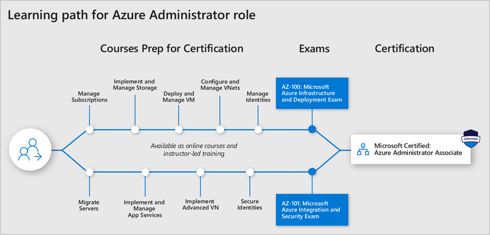
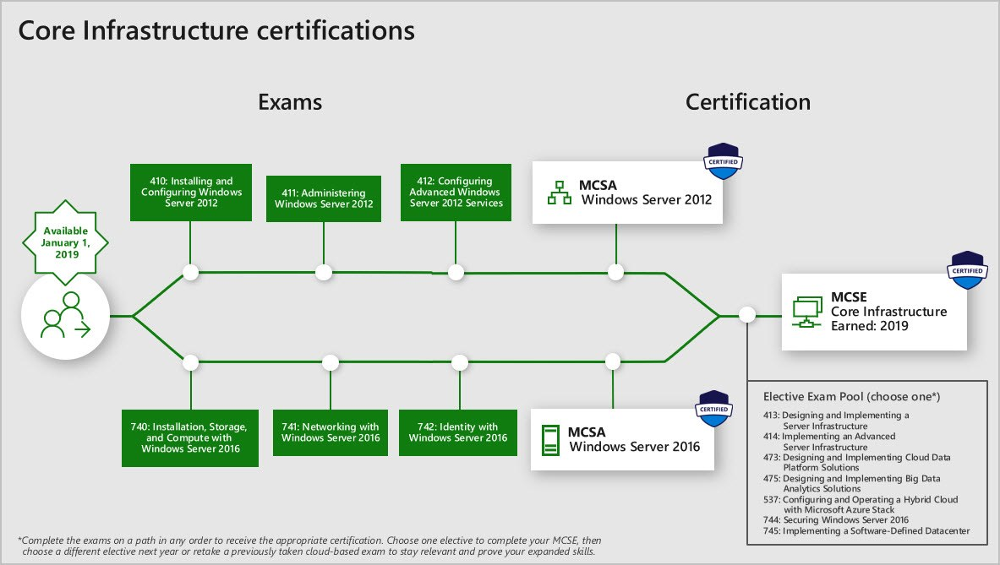

# New role-based certification and training is here, and we’re just getting started!

Posted 24 Sep 2018 by **Selina Winter**

___

Updated October 18, 2018 and March 4, 2019 to [extend the retirement date of the AZ-102 and AZ-302 Transition Exams](https://www.microsoft.com/en-us/learning/community-blog-post.aspx?BlogId=8&Id=375172) from March 31, 2019 to June 30, 2019

Updated January 10, 2019 to with a change to the MCSE: Core Infrastructure certification

Whether you’re in your first IT job or you’re a seasoned professional, you’ve worked hard to get where you are. You take your role seriously, and so do we. So, at [Ignite](https://www.microsoft.com/ignite) this week, we’re excited to announce our new [role-based certifications](https://www.microsoft.com/learning/browse-new-certification.aspx) to help you and your career keep pace with today’s business requirements. We’re evolving our program to better offer what you need to skill up, prove your expertise to employers and peers, and get the recognition—and opportunities—you’ve earned.

**What does this new program look like?**

To begin with, we’ve announced six new job roles: [Azure Administrator](https://www.microsoft.com/learning/azure-administrator.aspx), [Developer](https://www.microsoft.com/learning/azure-developer.aspx), [Solutions Architect](https://www.microsoft.com/learning/azure-solutions-architect.aspx), and DevOps Engineer; and Microsoft 365 Modern Desktop Administrator and Enterprise Administrator. In fact, the exams (and associated training) for the Azure Administrator certification are now live, and the next two certifications—[Azure Developer](https://www.microsoft.com/en-us/learning/community-blog-post.aspx?BlogId=8&Id=375155) and [Azure Solutions Architect](https://www.microsoft.com/en-us/learning/community-blog-post.aspx?BlogId=8&Id=375157)—have exams in beta. If you’re attending Ignite, you can [take the new exams for Azure Administrator, Developer, and Solutions Architect while you’re here](https://www.microsoft.com/en-us/ignite/experiences). The other three role-based certifications on this list will be launched before the end of the year. And these are just the start! Stay tuned, because we plan to announce more role-based certifications in 2019.

**What steps will you take?**

First, you’ll choose a learning path based on your role (or the role you aspire to), prepare for the exams with a series of courses (including microlearning, online training, instructor-led training, books, and more). You can even take practice tests to build your confidence and to let you know where you need to focus. Then, when you’re ready to sit for the exam, plan to spend about three hours, including 30 minutes for the introduction, instructions, and comments. You can expect 40–60 questions, and, since your job is hands-on, the exams will be, too. Beyond multiple choice, they also contain active screen scenarios, drag-and-drop options, and even several case studies that address situations you would encounter in the real world. We’re also exploring more performance-based testing in our new role-based certification, beginning with the Azure Administrator certification. Performance-based testing gives you the opportunity to demonstrate your skills in ways that align with the way you actually work. (Watch for more information in future blog posts.) For more details, [check out our exam policies](https://www.microsoft.com/learning/certification-exam-policies.aspx).

**What are transition exams?**

Transition exams are intended for people who have already demonstrated skills in the content domain by passing 70-XXX series exam(s) that are being replaced by the new role-based certification exams. Transition exams cover the delta between the current certification and the skills and concepts in the new certification.

Transition exams cover net new content, content that wasn’t covered in enough depth, and content on aspects of the technology that have likely changed since the original exam. As a result, the transition exam is not shorter than a 70-XXX series exam but is more focused on the key tasks and skills that were not assessed in the 70-XXX series exam or certification that is being replaced. [Learn more about transition exams](https://www.microsoft.com/en-us/learning/community-blog-post.aspx?BlogId=8&Id=375172).

| Candidates who have passed these Azure exams | Can take Azure Transition Exams | To earn these Microsoft Certifications  |
| --- | --- | --- |
| [70-532: Developing Microsoft Azure Solutions](https://www.microsoft.com/learning/exam-70-532.aspx) | [AZ-202: Microsoft Azure Developer Certification Transition](https://www.microsoft.com/learning/exam-AZ-202.aspx) (retires March 31, 2019) | [Microsoft Certified: Azure Developer Associate](https://www.microsoft.com/learning/azure-developer.aspx) |
| [70-533: Implementing Microsoft Azure Infrastructure Solutions](https://www.microsoft.com/learning/exam-70-533.aspx) | [AZ-102: Microsoft Azure Administrator Certification Transition](https://www.microsoft.com/learning/exam-AZ-102.aspx) (retires June 30, 2019) | [Microsoft Certified: Azure Administrator Associate](https://www.microsoft.com/learning/azure-administrator.aspx) |
| [70-535: Architecting Microsoft Azure Solutions](https://www.microsoft.com/learning/exam-70-535.aspx) | [AZ-302: Microsoft Azure Solutions Architect Certification Transition](https://www.microsoft.com/learning/exam-AZ-302.aspx) (retires June 30, 2019) | [Microsoft Certified: Azure Solutions Architect Expert](https://www.microsoft.com/learning/azure-solutions-architect.aspx) |

**Passed your exams?**

After you pass your exams, congratulations are in order! As is well-deserved recognition among your peers, colleagues, and employers. We’ll help you show up well, prove you are skilled and current in role tasks and multiple technologies, with the verified credentials you earn. Not only that, as you look for other opportunities in your industry, your [badges](https://www.microsoft.com/learning/badges.aspx)—updated with a fresh new look—open links to job postings from employers looking for your proven skills. Plus, we’ll make it easy to keep up with the new tasks as the roles, platforms, and technologies grow and expand. The certification and training will be updated on a regular basis. So you can be confident that, whenever you start the process, you’ll be working with current roles.

**Already working toward an MCSE: Cloud Platform & Infrastructure?**

Through **December 31, 2018**, you can continue to work toward your [MCSE: Cloud Platform & Infrastructure](https://www.microsoft.com/learning/mcse-cloud-platform-infrastructure.aspx) (and the associated MCSA certifications—[MCSA Windows Server 2012](https://www.microsoft.com/learning/mcsa-windows-server-certification.aspx), [MCSA Windows Server 2016](https://www.microsoft.com/learning/mcsa-windows-server-2016-certification.aspx), [MCSA Linux on Azure](https://www.microsoft.com/learning/mcsa-linux-azure-certification.aspx), and [MCSA Cloud Platform](https://www.microsoft.com/learning/mcsa-cloud-platform-certification.aspx)). Effective **January 1, 2019**, your options will be to pursue the new MCSE: Core Infrastructure certification, which includes MCSA Windows Server 2012 and MCSA Windows Server 2016, or to pursue Azure job role certification via the new certifications announced in this blog post.

UPDATE on January 10, 2019 that affects candidates who had already earned the MCSE: Cloud Platform and Infrastructure on or before December 31, 2018: As we started to program our systems to award the MCSE: Core Infrastructure certification to candidates who satisfied requirements prior to 2019, we determined that it didn’t make sense to replace the MCSE: Cloud Platform and Core Infrastructure certification with one that no longer referenced the cloud or to have both certifications appear on the transcript. Given the overwhelming interest by employers in cloud-based skills, retaining the word “cloud” in the candidates' certification will be much more valuable to candidates in their career and learning journey. As a result, we have decided not to make any changes to candidate certifications or transcripts, and the MCSE: Cloud Platform and Infrastructure will remain on your transcript in the Active Certifications section.

**Have more questions?**

Want an all-up view of the new certifications we’re launching? Download the **Microsoft Certification and Training Overview** PDF attached below to this post. Wondering how the new program affects your existing certifications? Rest assured that the certifications you have already earned will remain on your transcript. Wondering which exams are retiring? Check out the [exam retirement blog post.](https://www.microsoft.com/en-us/learning/community-blog-post.aspx?BlogId=8&Id=375158) Have other questions? Come visit the [Certification and Training booth at Ignite](https://www.microsoft.com/en-us/learning/community-blog-post.aspx?BlogId=8&Id=375160), or take a look at our [exam FAQs](https://www.microsoft.com/learning/certification-exam-policies.aspx).

**Ready to get recognized?**

As the *IDC Cloud Skills and Organizational Influence paper* notes, “IT professionals who evolve their skills will enhance their careers.”* And we’re here to help you do just that. Skill up for real-world jobs, get hands-on training inspired by working professionals, earn the certification (and [newly redesigned badges](https://www.microsoft.com/learning/badges.aspx)) to prove you can apply the skills in today’s demanding IT environment, and get the recognition and job you deserve.

**[Get all the details!](https://www.microsoft.com/learning/browse-new-certification.aspx)**

**Related announcements**

[Introducing Microsoft.com/learn](https://docs.microsoft.com/teamblog/introducing-ms-learn)  
[Skill up and stand out, with new role-based training and certification!](https://www.microsoft.com/en-us/learning/community-blog-post.aspx?BlogId=8&Id=375161)  
[Are You an Azure Solutions Architect? Take the New Role-Based Certification Exams Today!](https://www.microsoft.com/en-us/learning/community-blog-post.aspx?BlogId=8&Id=375157)  
[Are You an Azure Developer? Take the New Role-Based Certification Exams Today!](https://www.microsoft.com/en-us/learning/community-blog-post.aspx?BlogId=8&Id=375155)  
[Certification Exam Retirement Roundup: October 2018](https://www.microsoft.com/en-us/learning/community-blog-post.aspx?BlogId=8&Id=375158)  
[Update on Exam Retirements: Azure Transition Exams Extended](https://www.microsoft.com/en-us/learning/community-blog-post.aspx?BlogId=8&Id=375172)

*Anderson, Cushing. *[Cloud Skills and Organizational Influence: How Cloud Skills Are Accelerating the Careers of IT Professionals](https://download.microsoft.com/download/C/3/0/C3068200-2F9B-4D8D-BF5D-32E1F7ED669A/IDC_Microsoft_How_Cloud_Skills_Are_Accelerating_IT_Pro_Careers_May_2017.pdf)*. IDC/Microsoft, May 2017.

___

[Microsoft Certification and Training Overview_9-24-2018.pdf](https://query.prod.cms.rt.microsoft.com/cms/api/am/binary/RE3Njir)

