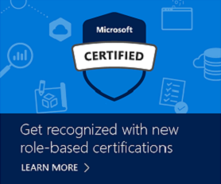

# Our Best-Kept Secret: Remote Online Exam Proctoring (aka Online MCP Exams!)

Posted 04 Dec 2017 by **Selina Winter**

___

Do you live in a rural area that’s not particularly close to a Pearson VUE testing center? Is the TRAFFIC in your area out of control? Wouldn’t it be nice to take your Microsoft certification exam in the comfort of your own home or in your office? You CAN! And we want to make sure that everyone knows this option is available. Imagine the time you’ll save with online testing.

While online testing is convenient, candidates do need to take extra steps to prepare their environment and their computer, so this delivery method may not meet your unique situation. Read on to discover if online testing is right for you.

Because we’re committed to protecting the integrity of our exams, when you take an online proctored exam, you must first install a secure browser that enforces rigorous safeguards throughout the testing process. In addition, a Pearson VUE proctor monitors you via webcam and microphone during the exam. For more details, watch [a short video](https://www.youtube.com/playlist?list=PLahhVEj9XNTceGnF19qSjYxYzS4S_Wlmf) (with subtitles in five languages), and visit [Online Proctored Exam Delivery](https://www.microsoft.com/learning/online-proctored-exams.aspx) at Microsoft Learning, where you’ll find topics such as:

- System test
- System requirements and identification requirements
- Testing session protocol
- Launching the exam and the candidate check-in process
- Retrieving your Score Report and removing proctor software
- FAQs

Candidates who meet the technical and security requirements for online testing report comparable levels of satisfaction compared to those who choose the testing center experience. And we’re constantly improving our delivery—in fact, we’ve just added a whiteboard feature in our exams so you can take notes during the exam!

To register for an exam, select the exam you wish to take from the [exam list](https://www.microsoft.com/learning/exam-list.aspx), and then click **Schedule exam**. If online proctored delivery is available in your country, you will be able to select that option during the exam registration process. Online proctoring is currently available for all Microsoft Certified Professional (MCP) and Microsoft Technology Associate (MTA) exams in participating countries, with greeter support, proctor support, and proctoring software offered in English. Microsoft Office Specialist (MOS) exams are not available for online delivery.

