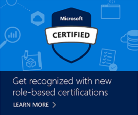

# Performance Testing Is Coming to Microsoft Exams: Here Is What You Should Know

Posted 15 Apr 2019 by **Liberty Munson (Microsoft)**

___

As many of you know, we are starting to add performance tasks to our exams (We refer to these tasks as “labs.”) This means that during an exam, you may be presented with a live environment in the cloud or on-premises, and you will perform tasks in that environment. This is an exciting time because in the very near future, you will have to complete performance tasks in at least one of the exams required to earn any of our new role-based certifications. Many of you have told us that we should be assessing your ability to perform tasks, and we are making that happen. However, we are pushing the boundaries of what’s possible in delivering labs; no other certification program has lab environments as complex or at this scale: the complexity of the labs ensures that you are provided with real-world scenarios that truly test your skills and abilities, and we are delivering these exams in nearly every country in the world.

In September 2018, we rolled out labs in our Azure Administrator exams (AZ100 & AZ101--soon to become AZ-103). Since then, we have learned a lot about the experience, what candidates are doing right (and wrong), and how we can improve the overall lab experience. While we continue to work on some of the most common challenges that test takers face (latency, restarts, etc.), here is some information to help you better understand what to expect and how to navigate the lab experience.

1. It takes time to provision the environment in the cloud, and the environment you will access to complete the tasks is loaded only when the resources are fully provisioned. As a result, the exam begins with a series of conventional items (multiple choice, drag and drop, build list, etc.) that allows time to provision the labs and load them into the environment. If you answer these questions too quickly, you will have to wait for the labs to finish loading.
2. After you leave any section of the exam, you cannot return to it. However, at the end of each section, you have the opportunity to review your answers. **Exam time does NOT stop while you are reviewing your answers. Make sure you manage your time;** pay attention to the time AND number of questions remaining. 
3. Each exam contains one or two performance sections/labs with multiple tasks that you must complete. Each is followed by a series of conventional items that allows us time to score the lab(s) so you can receive your pass/fail result as soon as the exam ends. Again, manage your time. You will have to answer some questions after the labs.

    *  The number of labs on the exam is provided on the overview page preceding the first lab. Read it! And then, manage your time accordingly.
    *  Keep in mind that the pattern of these exams is conventional items, followed by a lab, followed by more conventional items, and so on. We will put most of the conventional items at the beginning of the exam, but you will always end the exam by answering conventional items.
4. We are in the process of increasing the exam time to 180 minutes for all lab-based exams, so you have more time to complete the tasks. (It's taking you about 3x as long to complete a task as it does a conventional item.) Any time “lost” if the lab environment needs to restart while you are completing tasks is not deducted from your overall exam time.
5. If your lab launches with a blank white screen, try opening a new tab and navigating to [https://portal.azure.com](https://portal.azure.com). Opening this new tab will resolve the issue most of the time.  
6. Consider taking the exam via online proctoring. Doing so typically improves the overall experience, and you have complete control over the hardware, including the monitor size (smaller monitors are a consistent source of angst for test takers—we are looking into ways to maximize the screen real estate and improve this experience, but if you have a big monitor at work or home, consider using it for these exams). If you do take the exam at a test center, try asking the greeter/proctor for the computer with the largest monitor. Although VUE is advising test centers to reserve the largest monitors for Microsoft exams, it can’t hurt to ask. [Learn more about online proctoring requirements](https://www.microsoft.com/learning/online-proctored-exams.aspx). 
7. Do NOT wait for tasks to execute before moving onto another task. In some (rare) cases, you need something to execute before you can complete another task, but there should be other tasks that you can be working on while that task executes. **Don't lose time waiting for tasks to run.** Move onto something that is not dependent on that task so you can maximize your exam time. In some cases, starting a task may be sufficient for scoring (for example, creating a resource in Azure); you can let the task execute in the background while you work on other tasks. We include a note in the task list telling you that you only need to start the task. You can move on to other tasks or even leave the section (move to the next portion of the exam) without being penalized. **Read the task carefully. It may surprise you to learn that many test takers don’t read the instructions (shocking, I know). With labs, I strongly recommend that you do read everything carefully.**
8. We do NOT require you to use a specific method to perform tasks. If you are more comfortable using PowerShell or CLI, instead of a GUI, that’s what we want you to use. We test you on the end result of your task—did you perform it correctly?—not on the method that you use to perform a task.
9. If you run into issues with labs, please escalate them through our [exam item challenge process](https://www.microsoft.com/learning/certification-exam-policies.aspx#policies-5). Although we won’t be able to provide a specific explanation for your experience, our investigation into your experience will help us identify root causes and identify solutions that will improve the experience for everyone.
10. And most important, thank you for helping us on our journey as we continue to innovate in our approach to validating skills. We currently have labs in [AZ-100](https://www.microsoft.com/learning/exam-AZ-100.aspx), [AZ-101](https://www.microsoft.com/learning/exam-AZ-101.aspx) (soon [AZ-103](https://www.microsoft.com/learning/exam-AZ-103.aspx)), [AZ-300](https://www.microsoft.com/learning/exam-AZ-300.aspx), and [AZ-302](https://www.microsoft.com/learning/exam-AZ-302.aspx), with more to come starting in late May/early June. Microsoft is a leader in the certification industry (this is not hyperbole—it’s true), challenging the status quo, and we can only do that because you are with us every step of the way.

I hope these tips and tricks help you as you prepare for and take one of our lab-based exams. Best of luck!

