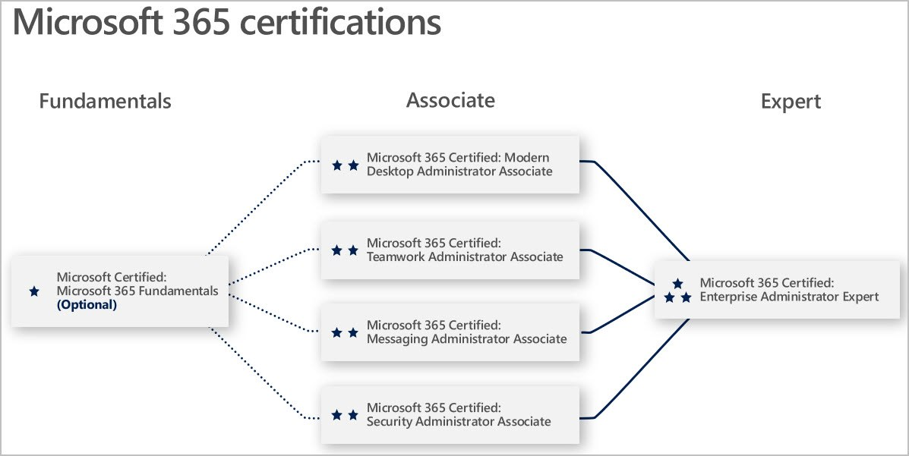

# Start with Our New Workload Certifications to Become a Microsoft 365 Enterprise Administrator

Posted 03 Dec 2018 by **Liberty Munson (Microsoft)**

___

January 17, 2019 and April 11, 2019: See updates in red below.

Microsoft 365 Workload certifications will put you on the path to becoming a [Microsoft 365 Certified: Enterprise Administrator Expert](https://www.microsoft.com/learning/m365-enterprise-administrator.aspx). If you’ve been following this blog, you know that we recently launched beta exams for Microsoft 365 Certified: [Enterprise Administrator](https://www.microsoft.com/en-us/learning/community-blog-post.aspx?BlogId=8&Id=375171) and [Modern Desktop](https://www.microsoft.com/en-us/learning/community-blog-post.aspx?BlogId=8&Id=375176). I hinted that there were more to come, and I know you’ve been on pins and needles waiting for me to tell the rest of the story. Well, here’s the next part of the story . . .

A [recent Deloitte survey](https://www2.deloitte.com/us/en/pages/deloitte-private/articles/technology-trends-middle-market-companies-survey.html) highlighted reskilling as a major priority for employers. It’s not a matter of doing more with less, but rather a matter of being more competitive overall; in fact, 46% of employers surveyed intended to expand hiring as a consequence of digital disruption. As Microsoft CVP Brad Anderson highlighted at Ignite, companies are looking to [level up with Microsoft 365](https://www.microsoft.com/en-us/microsoft-365/blog/2018/09/28/why-and-how-you-simplify-it-with-microsoft-365/), to move with more agility and innovate through collaboration. The question isn’t whether you should certify on Microsoft 365, but rather which of our workload certifications is right for you.

Let’s get you started on your certification journey.

___

***Microsoft 365 Certified: Fundamentals* ([Exam MS-900](https://www.microsoft.com/learning/exam-MS-900.aspx); available NOW)**

If you’re looking to get started in IT for the modern workplace and don’t have a strong background in technology, this is a great place to start. This exam validates knowledge of the considerations, benefits of adopting cloud services in general, the Software as a Service (SaaS) cloud model, and the options and benefits gained by implementing Microsoft 365 cloud service offerings. It will validate that you have a solid understanding of the basics of Microsoft 365, preparing you for Microsoft 365 job roles, such as [Modern Desktop Administrator,](https://www.microsoft.com/learning/modern-desktop.aspx) Teamwork Administrator, Messaging Administrator, and ultimately, [Microsoft 365 Enterprise Administrator](https://www.microsoft.com/learning/m365-enterprise-administrator.aspx). This exam is an **optional** precursor to cloud computing and technologies exams, such as Office 365, Microsoft Intune, Azure Information Protection (AIP), and Windows 10.

___

***[Microsoft 365 Certified: Modern Desktop Administrator Associate](https://www.microsoft.com/learning/modern-desktop.aspx)* (Exams [MD-100](https://www.microsoft.com/learning/exam-MD-100.aspx) and [MD-101](https://www.microsoft.com/learning/exam-MD-101.aspx); available NOW!)**

Our Modern Desktop Administrator Associate certification will bring you up to speed on the requirements and mechanics for deploying Windows 10, your first step to implementing Modern Desktop solutions. You’ll also learn how to simplify your deployments using in-place upgrade, Windows Autopilot and integrated identity solutions to improve user experience and increase productivity.

If you passed [Exam 70-698](https://www.microsoft.com/learning/exam-70-698.aspx)  before it expired on March 31, 2019, you only need to take one exam (MD-101) before July 31, 2019 to earn the Modern Desktop certification. Starting August 1, 2019, both MD-101 and MD-101 are required exams and the only path to earn a [Microsoft 365 Certified: Modern Desktop Administrator Associate](https://www.microsoft.com/learning/modern-desktop.aspx) certification.

___

***[Microsoft 365 Certified: Messaging Administrator Associate](https://www.microsoft.com/learning/m365-messaging-administrator.aspx)* (Exams [MS-200](https://www.microsoft.com/learning/exam-MS-200.aspx), [MS-201](https://www.microsoft.com/learning/exam-MS-201.aspx), and [MS-202](https://www.microsoft.com/learning/exam-MS-202.aspx); available NOW)**

If you’re an Exchange admin, this is the certification for you. Technology has given companies a breadth of options for communicating both inside and outside of organizations, but with that expanded access comes risk; companies need administrators who know how to mitigate those risks. This certification will validate that you have the skills you need to design and manage compliant and secure communications solutions with Microsoft 365’s industry leading suite of tools.

If you’ve passed [Exam 70-345: Designing and Deploying Microsoft Exchange Server 2016](https://www.microsoft.com/learning/exam-70-345.aspx), take Exam MS-202: Microsoft 365 Messaging Administrator Certification Transition Exam to earn this new role-based certification in one step.

___

***[Microsoft 365 Certified: Teamwork Administrator Associate](https://www.microsoft.com/learning/m365-teamwork-administrator.aspx)* (Exams [MS-300](https://www.microsoft.com/learning/exam-MS-300.aspx), [MS-301](https://www.microsoft.com/learning/exam-MS-301.aspx), and [MS-302](https://www.microsoft.com/learning/exam-MS-302.aspx); available NOW)**

Collaboration tools are at the crux of the modern workplace. Teams need to be able to access and revise their data more quickly than ever before, and they need integrated solutions that are secure and scalable and that don’t stand in the way of a distributed workforce. This certification will validate your skills in designing elegant, secure, and compliant solutions that solve your company’s most challenging productivity puzzles.

If you’ve passed [Exam 70-339: Managing Microsoft SharePoint Server 2016](https://www.microsoft.com/learning/exam-70-339.aspx), take [MS-302](https://www.microsoft.com/learning/exam-MS-302.aspx): Microsoft 365 Teamwork Administrator Certification Transition Exam to earn this new certification with just a single exam.

___

***[Microsoft 365 Certified: Security Administrator Associate](https://www.microsoft.com/learning/m365-security-administrator.aspx)*([Exam MS-500](https://www.microsoft.com/learning/exam-MS-500.aspx); available NOW!)**

The oversight of qualified security administrators is not only crucial to the success of IT implementations and operations, [Forbes reports that it’s also one of the most in-demand roles in technology](https://www.forbes.com/sites/forbestechcouncil/2018/08/09/the-cybersecurity-talent-gap-is-an-industry-crisis/) and the talent gap is expected to keep growing. This certification will show your organization that you have the skills needed to protect your company against ever more complex cybersecurity threats and to [remain compliant with increasingly layered and diverse data regulation](https://www.microsoft.com/en-us/microsoft-365/blog/2018/09/25/start-using-microsoft-365-to-accelerate-modern-compliance/).

___

Choosing any of Microsoft’s certification paths helps you to stand out to both current and potential employers, proving that you have the IT skills that they need to remain agile and competitive. And we help you prove it, too: one click on our newly redesigned [badges](https://www.microsoft.com/learning/badges.aspx) allows colleagues and employers to confirm your specialization  and learn more about your qualifications. This helps you stand out to your peers and employer, and even [unlocks new employment opportunities](https://www.microsoft.com/en-us/learning/community-blog-post.aspx?BlogId=8&Id=375167) based on your proven skills and knowledge.

## How do I get started?

Visit Microsoft’s [Technical Certifications](https://www.microsoft.com/learning/browse-new-certification.aspx) to learn more about the certifications available to you. After you’ve decided which certification to pursue, find the training option that is right for you to help prepare for the exams, including instructor-led training provided through one of our [Microsoft Learning Partners](https://www.microsoft.com/learning/partners.aspx) and free online options at [Microsoft Learn](https://docs.microsoft.com/learn/).

**Questions?** For an overview of our redesigned program, check out our [role-based certification blog announcement](https://www.microsoft.com/en-us/learning/community-blog-post.aspx?BlogId=8&Id=375161).  You can also check out our [exam FAQs](https://www.microsoft.com/learning/certification-exam-policies.aspx) for more information on what to expect when you’re ready to test.

And, stay tuned for the rest of the story on how you earn your Microsoft 365 Certified Enterprise Administrator Expert certification!

**Related announcements**

[Skill up and stand out, with new role-based training and certification!](https://www.microsoft.com/en-us/learning/community-blog-post.aspx?BlogId=8&Id=375161)   
[New role-based certification and training is here, and we’re just getting started!](https://www.microsoft.com/en-us/learning/community-blog-post.aspx?BlogId=8&Id=375159)   
[Certification Exam Retirement Roundup: October 2018](https://www.microsoft.com/en-us/learning/community-blog-post.aspx?BlogId=8&Id=375158)   
[Calling All M365 Enterprise Administrators: Take Our Two New Beta Exams MS-100 & MS-101!](https://www.microsoft.com/en-us/learning/community-blog-post.aspx?BlogId=8&Id=375171)   
[Microsoft’s New Fundamentals Certification Program Launches with Azure and Microsoft 365](https://www.microsoft.com/en-us/learning/community-blog-post.aspx?BlogId=8&Id=375177)  
[Becoming a Microsoft 365 Certified Enterprise Administrator Expert—The Final Steps  
](https://www.microsoft.com/en-us/learning/community-blog-post.aspx?BlogId=8&Id=375182)[Exam and Certification Retirement Roundup, December 2018  
](https://www.microsoft.com/en-us/learning/community-blog-post.aspx?BlogId=8&Id=375189)[Calling all Microsoft 365 Security Administrators! MS-500 is Now Available in Beta](https://www.microsoft.com/en-us/learning/community-blog-post.aspx?BlogId=8&Id=375191)  
[Hey! Teamwork Administrators! Beta Exams Now Available!  
](https://www.microsoft.com/en-us/learning/community-blog-post.aspx?BlogId=8&Id=375195)[Messaging Administrators—We Need Your Help…Beta Exams Now Available!](https://www.microsoft.com/en-us/learning/community-blog-post.aspx?BlogId=8&Id=375196)<u>  
</u>

