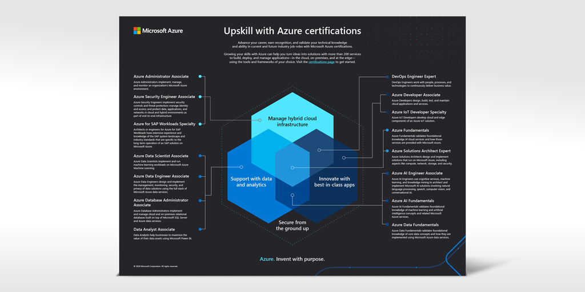

# Understanding Microsoft Azure certifications

Posted 19 May 2020 by **Sandra Marin, Azure training and certification GTM lead, Microsoft Learning**

___

Are you ready to meet the challenges of today’s economy, with its new jobs, processes, and technologies? Job requirements continue to evolve—in fact, the average life of a skill today is less than five years. In this cloud-based and continuously connected world, it’s important to keep growing your skill set, experience, and abilities. IT professionals are now more than ever agents of change. Take advantage of Azure certifications to help advance your career, earn recognition, and validate your technical knowledge and abilities in current and future industry job roles.

Looking to level up your career or jump-start a new one? No matter which stage you’re in, you can use Azure certifications to build and validate your technical knowledge and abilities in the modern cloud environment. In these unsettling times, earning your Microsoft Certification can help provide you with the edge you need. Need inspiration? Check out our new video, “[Microsoft Certifications for Azure video](https://aka.ms/AzureCerts_Video).”

## Use your profession to find a certification

Azure certifications allow system administrators (IT pros), developers, and data and AI professionals to validate that they have the skills necessary to cover all aspects of digital transformation. These skills range from managing on-premises, hybrid, or cloud infrastructure, to innovating with the best-in class applications, to supporting those apps and infrastructure with data and analytics—all with the proper security considerations. For a high-level look at all of our certifications, organized by professional roles, check out the blog post “[Finding the right Microsoft Azure certification for you](https://www.microsoft.com/en-us/learning/community-blog-post.aspx?BlogId=8&Id=375306).”

## Target the right certification for your skills

In our portfolio, certifications are designed for specific skills. Some are best suited for individual job roles. Several of our certifications are a good fit for more than one technical audience or profession. How do you decide which one is the best for you?

Perhaps a picture would help. We’ve put together “[Upskill with Azure certifications](https://aka.ms/AzureCerts_Poster),” an illustration that shows how the certifications intersect with core skills required for Azure. Choose your skills, and see which certifications align with them. [Download the poster](https://aka.ms/AzureCerts_Poster), and use it to help decide which certifications best fit your skill set.  

## Make the most of your career: We’re in your corner

We have plenty of resources to help you skill up in your career.  When you’re ready, we can help you prepare for your certification exam.

Check out instructor-led training based on [Microsoft Official Courseware](https://docs.microsoft.com/learn/certifications/courses/browse/?products=azure) delivered by [Microsoft Learning Partners](https://www.microsoft.com/learning/partners.aspx) and taught by Microsoft Certified Trainers (MCTs). These official courses are designed and created from the same blueprint as our certification exams.

Explore free online training on [Microsoft Learn](https://docs.microsoft.com/learn/azure/), including step-by-step tutorials and browser-based interactive coding and scripting environments. Plus, you don’t need an Azure subscription to do most of the labs, since Microsoft Learn has a free sandbox environment.

Prepare for Azure role-based certifications with free online content from our partner [Pluralsight](https://azure.com/pluralsight), with content developed using our exam blueprints.

Want a trial run? Try a [Microsoft Official Practice Test](https://www.measureup.com/microsoft-technical/microsoft-practice-tests.html) created by our partner MeasureUp and based on our exam outlines.

## It’s time to level up!

Passionate about exploring new technical areas? Check out the blog post “[Finding the right Microsoft Azure certification for you](https://www.microsoft.com/en-us/learning/community-blog-post.aspx?BlogId=8&Id=375306)”, for more details on our certification portfolio, including two new fundamentals certifications.

Whether you’re just starting your cloud learning journey or you’re a seasoned pro who builds and deploys business-critical workloads on-premises, hybrid, or in the cloud, choose from a wide variety of certifications to help advance your career, recognition, and validate your technical knowledge and abilities.

## Related announcements

[Finding the right Microsoft Azure certification for you](https://www.microsoft.com/en-us/learning/community-blog-post.aspx?BlogId=8&Id=375306)  
