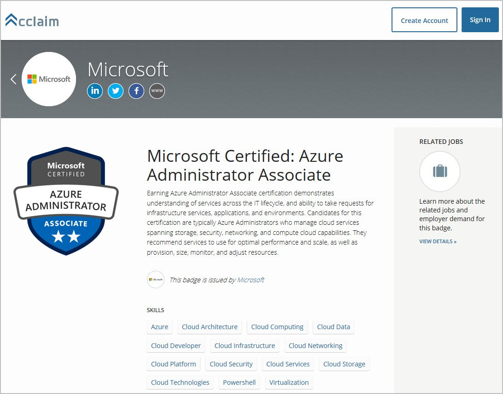
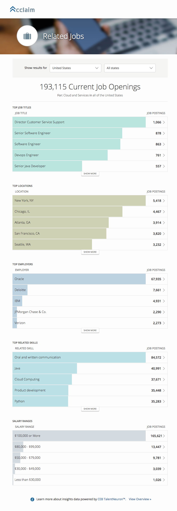
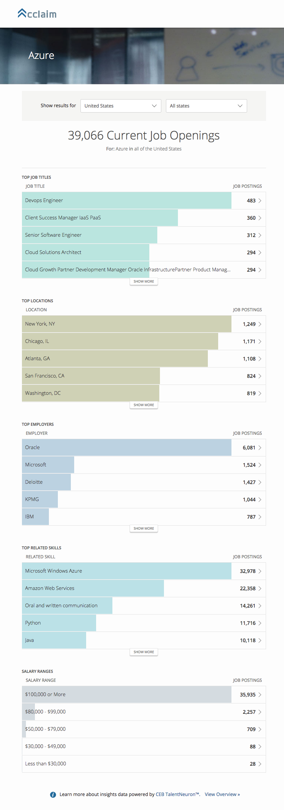

# Unlock Active Job Postings with Your Microsoft Certification (updated)

Posted 15 Oct 2018 by **Selina Winter (Microsoft Certification Program Manager)**

___

**Note: The Acclaim platform is now provided by Credly.**

If you hold a Microsoft certification and you're in the market for a job in technology, here’s how your digital badge on Credly’s Acclaim platform can help: you can unlock access to real-time job data tailored to your skills and certifications, including active job postings, requirements and estimated salaries. If you’ve explored this job data before, give it another look, as we optimized the results earlier this year.*

Credly’s Acclaim platform provides real-time job data in partnership with Gartner TalentNeuron™. The data is sourced and updated 24/7 from more than 25,000 global job boards and corporate career sites, the U.S. Census Bureau, and the U.S. Bureau of Labor Statistics. You’ll see active job data and job descriptions that are customized to the skills covered in the exam you just passed or the certification you just earned. [Watch a short video on the job data.](https://www.youtube.com/watch?v=G4qBl17VgBo)

How does it work? Take a peek at the job data for the new role-based certification [Microsoft Certified: Azure Administrator Associate](https://www.youracclaim.com/org/microsoft-certification/badge/microsoft-certified-azure-administrator-associate) (shown in the first screen below—click to enlarge).

- Under **Related Jobs** in the right panel, click **View Details** to see 193,115 current job openings in the U.S. as of this writing, shown also filtered by state and top employer. (Second screen below.)

- Under **Skills**, click a skill like **Azure** to see 39,066 current job openings in the U.S. as of this writing (third screen).

In either case, click a **Job Title** (second screen) to see links to individual active job postings—with salary estimates! Job postings are also shown by top locations, top employers, and top related skills. You can also filter the job data by country (Australia, Brazil, Canada, India, the U.K., and the U.S.) and by state. Credly plans to add more countries based on demand.

Use one of the Quick Access links below to access job data for top certifications, or [access job data for all Microsoft badges](https://www.youracclaim.com/organizations/microsoft-certification).

Accept a badge in your account on the Acclaim platform to explore the job data and recommendations for future exams and certifications based on your individual certifications. You can accept a badge at any time through the notifications sent by Credly’s Acclaim platform. If you’ve deleted those emails, you can go to the [Acclaim platform site](http://www.youracclaim.com/) and click the profile icon in the top right corner to create an account with the same email address that Microsoft has on file for you. Having trouble accepting your badge? Reach out to [Credly‘s support team](http://support.youracclaim.com/) for additional assistance. Your badge and your new job data will be waiting for you to accept in your account. Unlock your job data now! And let us know how it goes.

*For a refresher on our [digital badging program](https://www.microsoft.com/learning/badges.aspx), see our blog post [How to Claim Your Digital Badge—and Why (updated)](https://www.microsoft.com/en-us/learning/community-blog-post.aspx?BlogId=8&Id=375169).

**Quick Access to New Role-Based Certifications and Top MCSE and MSCD Certifications on the Acclaim platform:**

[https://www.youracclaim.com/org/microsoft-certification/badge/microsoft-certified-azure-administrator-associate](https://www.youracclaim.com/org/microsoft-certification/badge/microsoft-certified-azure-administrator-associate)  

[https://www.youracclaim.com/org/microsoft-certification/badge/mcse-cloud-platform-and-infrastructure-certified-2018](https://www.youracclaim.com/org/microsoft-certification/badge/mcse-cloud-platform-and-infrastructure-certified-2018)

[https://www.youracclaim.com/org/microsoft-certification/badge/mcse-productivity-certified-2018](https://www.youracclaim.com/org/microsoft-certification/badge/mcse-productivity-certified-2018)

[https://www.youracclaim.com/org/microsoft-certification/badge/mcse-data-management-and-analytics-certified-2018](https://www.youracclaim.com/org/microsoft-certification/badge/mcse-data-management-and-analytics-certified-2018)

[https://www.youracclaim.com/org/microsoft-certification/badge/mcse-business-applications-certified-2018](https://www.youracclaim.com/org/microsoft-certification/badge/mcse-business-applications-certified-2018)

[https://www.youracclaim.com/org/microsoft-certification/badge/mcsd-app-builder-certified-2018](https://www.youracclaim.com/org/microsoft-certification/badge/mcsd-app-builder-certified-2018)

**All Job Openings for Microsoft Certified: Azure Administrator Associate**

**Job Openings for the Azure Skill for Microsoft Certified: Azure Administrator Associate**

