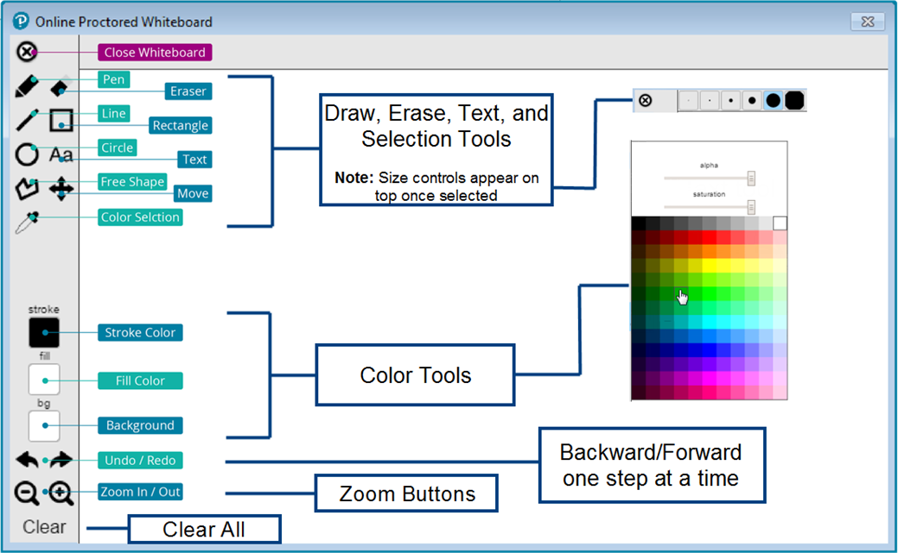

# Whiteboard Feature Now Available in Online Proctored Exams

Posted 06 Dec 2017 by **Liberty Munson (Microsoft)**

___

[As Microsoft continues to improve the online proctoring experience, we are happy to announce that you now have access to a virtual whiteboard when you take an online proctored exam. This has been a pain point for many who like to take notes (e.g., keeping track of detailed requirements in case studies, drawing network diagrams, performing calculations, etc.) during the exam to help them manage their time and understanding of the problems presented in the exam questions. Until recently, test takers could not do what they could in a test center—jot down notes. The virtual whiteboard gives candidates the option to work through items visually by entering notes or drawing shapes](images/3580-launch-whiteboard-small.png)[.](images/3580-launch-whiteboard-small.png)

Accessing the whiteboard during your exam is super easy. You simply click the eraser icon at the top of the screen (click image to expand).

This feature allows candidates to:

- Enter text and draw shapes and lines
- Change the stroke size of lines, the fill and background colors of shapes, and the size and font of text
- Erase or clear to start something new

Whiteboard working space (click to expand):

The next time you take an online proctored exam, try the whiteboard feature and let me know what you think.

